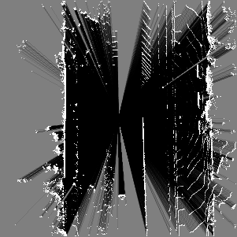
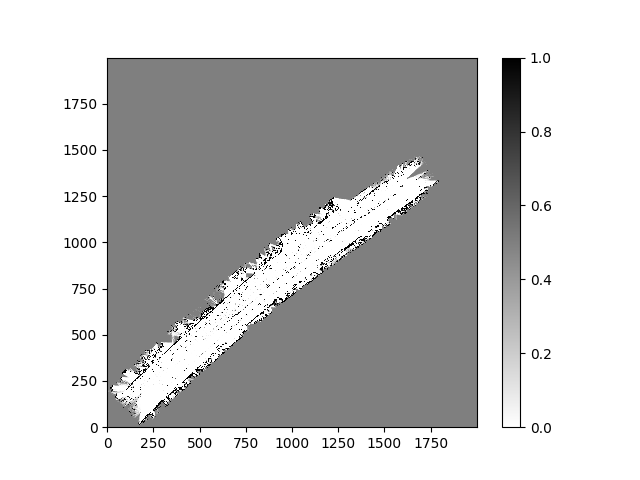
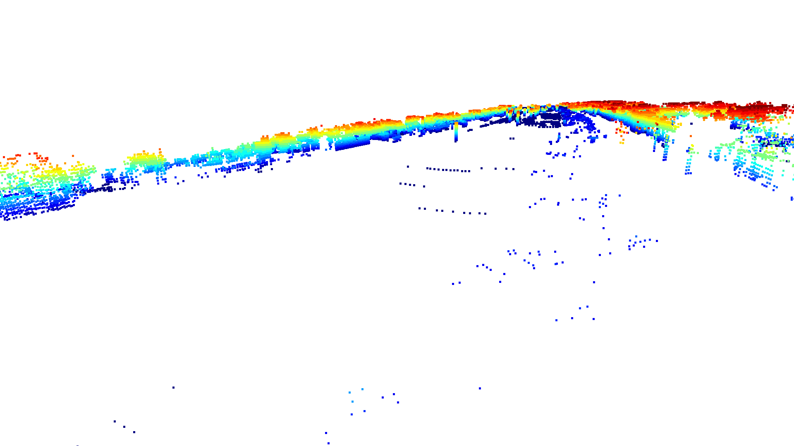
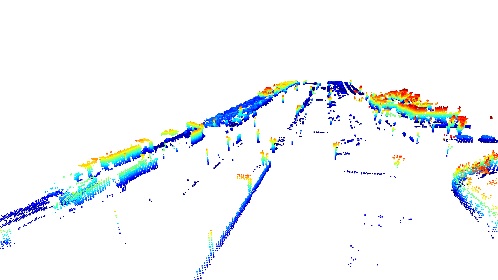
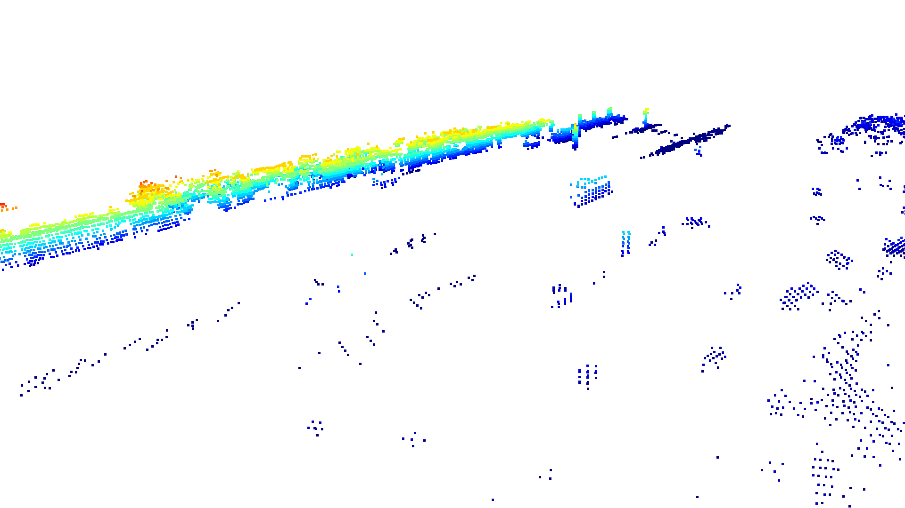

# Occupancy Grid Mapping

A probabilistic 3D occupancy grid mapping system built from scratch in Python, using Bayesian log-odds updates and LiDAR point clouds from the KITTI dataset.



---

## Overview

Occupancy grid mapping turns the environment into a probabilistic map of occupied and unoccupied cells. This is important for AV systems as it allows them to calculate whether certain areas are safe to traverse or move to. A probabilistic representation is important as it allows agents to make educated decisions without locking them behind binary absolutes.

KITTI, the Karlsruhe Institute of Technology and Toyota Technological Institute at Chicago, provides LiDAR datasets for autonomous driving benchmark training. This implementation ingests their raw point clouds, filters and pose-transforms the data, and updates a voxel grid with Bayesian inference — producing 2D top-down maps, 3D voxel visualizations, and animated reconstructions of the driving sequence.

Methods implemented from scratch include Bresenham's ray casting algorithm, log-odds Bayesian update rule, coordinate frame transformations using homogeneous matrices, and a RANSAC ground removal pipeline — all built on NumPy arrays without heavy reliance on existing mapping libraries.

---

## Mathematical Foundation

### Bayesian Update Problem

For each cell $m_i$ in the grid, we maintain the probability that it is occupied given all sensor measurements up to time $t$:

$$P(m_i = 1 \mid z_{1:t})$$

where $m_i = 1$ denotes occupied, $m_i = 0$ denotes free, and $z_{1:t}$ represents all sensor measurements from time $1$ to $t$.

### Log-Odds Representation

Rather than updating probabilities directly (which requires repeated multiplication and introduces floating point errors), we work in log-odds space:

$$l = \log\frac{p}{1-p}$$

This transforms the Bayesian update into a simple addition:

$$l_t = l_{t-1} + l_{\text{sensor}}$$

where $l_{\text{sensor}}$ is the **inverse sensor model** — the log-odds probability that a cell is occupied given the specific measurement (hit vs. free space). To recover probability for visualization, we apply the sigmoid:

$$P(m_i = 1) = \frac{1}{1 + e^{-l}}$$

### Sensor Model

Hit and free space updates are fixed log-odds constants chosen to prevent occupied cells from being washed out by the high volume of free space ray traversals:

| Event | Log-odds update | P(occupied) |
|-------|----------------|-------------|
| Ray endpoint (hit) | +2.0 | 0.88 |
| Ray passes through (free) | -0.2 | 0.45 |

Values are clamped to $[-10, 10]$ to prevent runaway certainty.

---

## Implementation Details

The program first loads the raw dataset using `pykitti`, which provides access to individual LiDAR scans, IMU pose data, and calibrated Velodyne points. Each scan is filtered by range (30m) and height (-2m to +2m) to remove distant and irrelevant returns.

A pose transformation using the IMU's 4×4 homogeneous transformation matrix is applied to convert points from sensor frame into a fixed world coordinate frame, correctly accounting for both vehicle translation and rotation between frames. Points are then converted to grid indices at 0.2m per cell resolution.

Ground removal is applied per scan using Open3D's RANSAC plane segmentation. A pre-filter isolates candidate ground points by height before RANSAC fits a plane equation, which is then used to remove ground returns from the full scan. This prevents flat road surface returns from being incorrectly marked as occupied.

Ray casting with Bresenham's line algorithm traces each beam from the sensor origin to its hit point, marking intermediate cells as free space and the endpoint as occupied. Free and hit cell indices are batched across all points per scan and applied to the grid in a single vectorized `np.add.at` operation.

---

## Results

Results were generated using KITTI sequence `2011_09_26_drive_0015` — 297 frames of urban driving.

### 2D Top-Down Map


*The continuous driving corridor is clearly visible, with obstacle clusters along the road boundaries representing buildings, parked cars, and other static structures.*

### 3D Voxel Visualization




*The 3D view provides height-encoded structure, allowing identification of objects such as poles, vehicles, fences, and building facades along the route.*

---

## Installation

Python 3.11 required.

```bash
pip install -r requirements.txt
```

### Dataset Setup

Download the KITTI raw dataset from https://www.cvlibs.net/datasets/kitti/raw_data.php.
Download the synced+rectified data and calibration files for sequence `2011_09_26_drive_0015`.

Organize the data as follows:

```
data/
└── kitti/
    └── 2011_09_26/
        ├── calib_cam_to_cam.txt
        ├── calib_imu_to_velo.txt
        ├── calib_velo_to_cam.txt
        └── 2011_09_26_drive_0015_sync/
            ├── velodyne_points/
            └── oxts/
```

---

## Usage

```bash
python sensor_model.py
```

The program prompts for three inputs:

| Prompt | Description |
|--------|-------------|
| Render mode | `1` = 2D top-down map, `2` = 3D voxel visualization, `3` = animated 2D reconstruction |
| Starting scan | `0` to start from the beginning of the sequence |
| Number of scans | Up to `297` for the full sequence |

Output files are saved to the project root:
- `testGrid.png` — 2D occupancy map (modes 1 and 2)
- `occupancy.gif` — animated reconstruction (mode 3)

---

## Future Work

- **Bresenham performance** — ray casting is the primary bottleneck, with Bresenham called once per point in a Python loop. Compiling with Numba's `@njit` decorator would reduce this to near C-speed with minimal code changes.
- **Vegetation filtering** — sparse vegetation returns survive the current filters. Intensity-based thresholding (low-intensity returns typical of leaves and grass) or more aggressive statistical outlier removal would reduce this noise.
- **Dynamic object handling** — moving objects like cars accumulate conflicting occupied and free updates as they move through the scene. A log-odds decay term or object detection integration would improve map accuracy.
- **Adaptive sensor model** — current hit and free constants are fixed. A distance-weighted sensor model where certainty decreases with range would more accurately reflect real LiDAR behavior.

---

## References

- Thrun, S., Burgard, W., Fox, D. (2005). *Probabilistic Robotics*. MIT Press.
- Geiger, A., Lenz, P., Stiller, C., Urtasun, R. (2013). Vision meets Robotics: The KITTI Dataset. *International Journal of Robotics Research*.
- Bresenham, J.E. (1965). Algorithm for computer control of a digital plotter. *IBM Systems Journal*, 4(1), 25–30.
- Zhou, Q.Y., Park, J., Koltun, V. (2018). Open3D: A Modern Library for 3D Data Processing.
- NumPy Documentation. https://numpy.org/doc/
- KITTI Raw Data. https://www.cvlibs.net/datasets/kitti/raw_data.php
